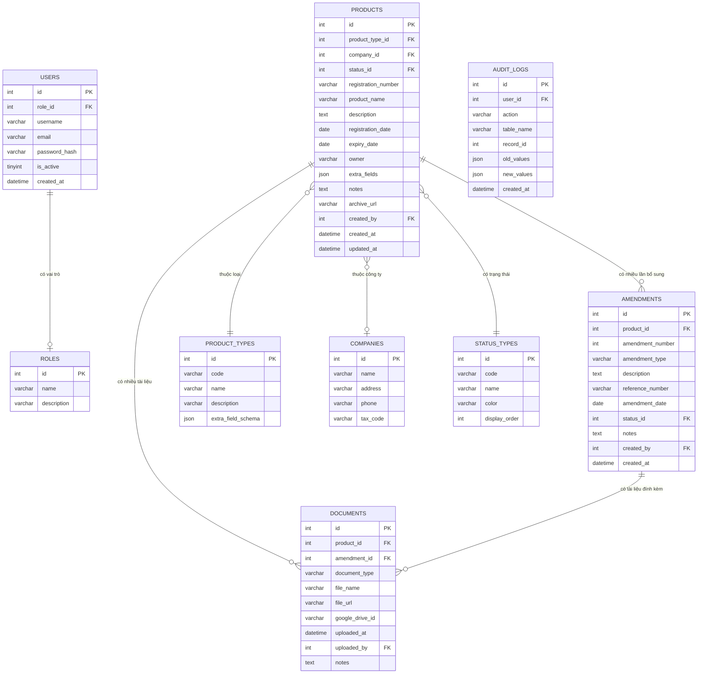
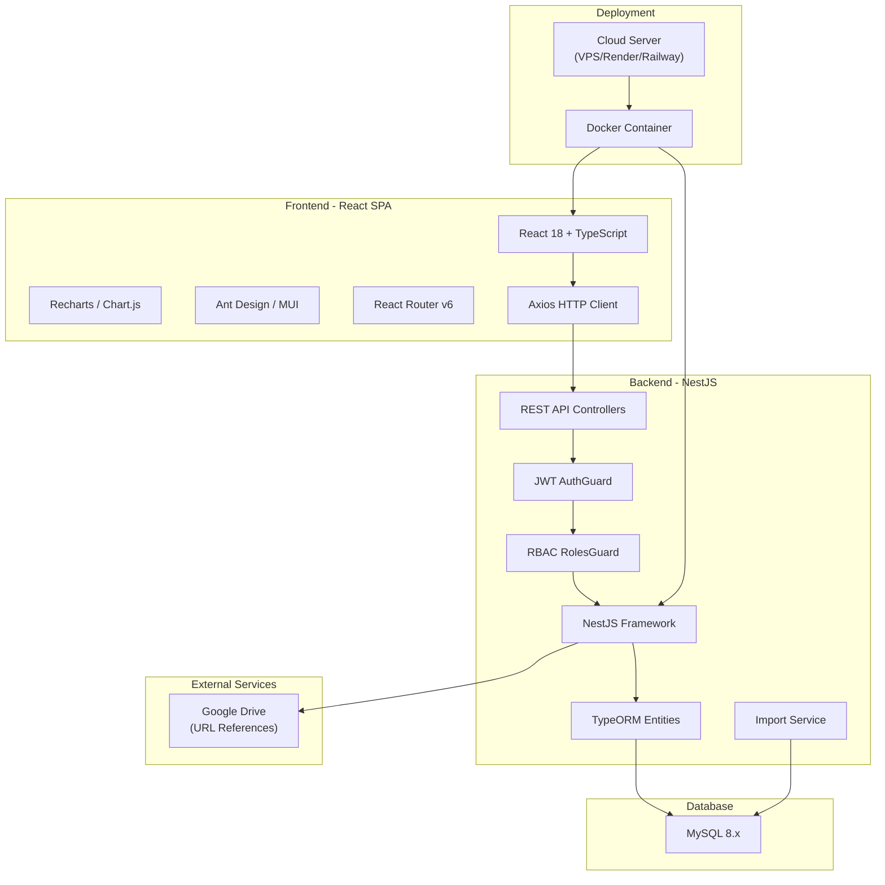
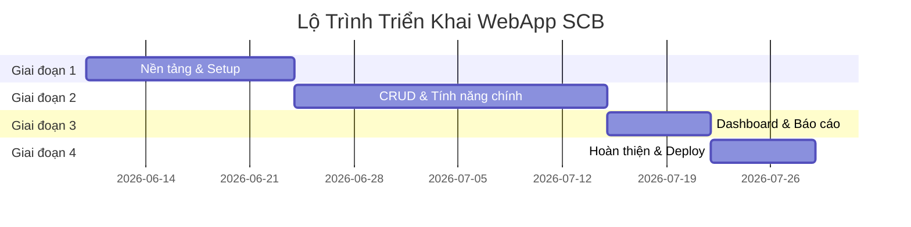

# 📋 KẾ HOẠCH TỔNG THỂ
# Hệ Thống Quản Lý Số Công Bố Sản Phẩm

## Chuyển Đổi Từ AppSheet → WebApp

> **Mã dự án:** SCB-2026
> **Ngày tạo:** 2026-06-10
> **Phiên bản:** v1.1
> **Trạng thái:** ĐÃ DUYỆT

---

## 📌 Tóm Tắt Dự Án

| Hạng mục | Chi tiết |
|----------|----------|
| **Mục tiêu** | Chuyển đổi hệ thống quản lý số công bố sản phẩm từ AppSheet sang WebApp chuyên nghiệp |
| **Phạm vi** | 6 loại sản phẩm: Thuốc, TBYT, TPBVSK, Mỹ phẩm, CFS/CPP, CB_TPBS |
| **Người dùng** | Trên 10 người (toàn công ty) |
| **Thời gian dự kiến** | 5-7 tuần |

---

## ✅ Các Quyết Định Đã Duyệt

| # | Hạng mục | Quyết định | Lý do |
|---|----------|------------|-------|
| 1 | 🌐 **Triển khai** | Deploy lên server/cloud | Truy cập từ nhiều nơi, nhiều người dùng đồng thời |
| 2 | 🗄️ **Database** | MySQL | Phổ biến, dễ quản lý, hỗ trợ JSON column, nhiều hosting hỗ trợ sẵn |
| 3 | 📁 **Lưu trữ file** | Giữ nguyên Google Drive (chỉ lưu URL) | Không phải di chuyển file hiện tại, tiết kiệm dung lượng server |
| 4 | 👥 **Người dùng** | Trên 10 người — RBAC phân quyền | Admin / Editor / Viewer |
| 5 | 📥 **Import dữ liệu** | Export CSV/Excel từ AppSheet → Import vào hệ thống mới | Giữ toàn bộ dữ liệu lịch sử |

---

## PHẦN I — PHÂN TÍCH HIỆN TRẠNG

### 1.1 Tổng Quan Hệ Thống AppSheet Hiện Tại

Hệ thống AppSheet hiện tại gồm **6 bảng (tables)** quản lý các loại sản phẩm khác nhau:

| # | Bảng | Số cột | Key | Mô tả |
|---|------|--------|-----|-------|
| 1 | **CB_TPBS** | 9 | _ComputedKey | Công bố thực phẩm bổ sung |
| 2 | **Cpp CFS** | 10 | Mã hồ sơ | Chứng nhận lưu hành tự do (CFS/CPP) |
| 3 | **Mỹ Phẩm** | 13 | Số tiếp nhận | Mỹ phẩm |
| 4 | **TBYT** | 53 | Số tiếp nhận | Trang bị y tế |
| 5 | **TPBVSK** | 28 | Số công bố | Thực phẩm bảo vệ sức khỏe |
| 6 | **Thuốc** | 74 | Mã hồ sơ | Thuốc |

**Tổng: 187 cột** trải rác trên 6 bảng độc lập.

### 1.2 Chi Tiết Cấu Trúc Từng Bảng

#### Bảng 1: CB_TPBS — Công bố thực phẩm bổ sung (9 cột)

| Cột | Kiểu | Bắt buộc |
|-----|------|----------|
| Số tự công bố | Text | ✅ |
| Tên sản phẩm | Text | ✅ |
| Cơ sở đứng tên | Text | ✅ |
| Dạng sản phẩm | Text | ✅ |
| Ngày công bố | Date | — |
| Ghi chú | LongText | — |
| Hồ sơ lưu | Url | — |

#### Bảng 2: Cpp CFS — Chứng nhận lưu hành tự do (10 cột)

| Cột | Kiểu | Bắt buộc |
|-----|------|----------|
| Mã hồ sơ | Text | ✅ (Key, Label) |
| Tên thuốc | Text | — |
| Loại hình | Enum | — |
| Nước xuất khẩu | Text | — |
| Ngày cấp | Text | — |
| Ngày hết hạn | Text | — |
| Tình trạng | Text | — |
| Ngày hết hạn_8 | Text | — |
| Công văn cấp | File | — |

#### Bảng 3: Mỹ Phẩm (13 cột)

| Cột | Kiểu | Bắt buộc |
|-----|------|----------|
| Số tiếp nhận | Text (Key, Label) | ✅ |
| TÊN MỸ PHẨM | Text | — |
| Nhãn hàng | Text | — |
| Dạng mỹ phẩm | LongText | — |
| CÔNG TY | Text | — |
| NGÀY CÔNG BỐ | Date | ✅ |
| NGÀY HẾT HẠN | Date | ✅ |
| Tình trạng | Enum | — |
| PHIẾU CÔNG BỐ | File | — |
| HS BỊ THAY THẾ/GHI CHÚ | Text | — |
| XN QUẢNG CÁO | File | — |
| Hồ sơ lưu | Url | ✅ |

#### Bảng 4: TBYT — Trang bị y tế (53 cột) ⚠️ Phức tạp

| Nhóm | Các cột chính |
|------|---------------|
| **Thông tin cơ bản** | Số tiếp nhận (Key), Tên thương mại, Tên TBYT/chủng loại, Phân loại (Enum), Chủ sở hữu |
| **Ngày tháng** | Ngày tiếp nhận (default: TODAY()) |
| **Trạng thái** | Tình trạng (Enum) |
| **Tài liệu gốc** | Phiếu tiếp nhận, Tài liệu mô tả kỹ thuật, Tiêu chuẩn cơ sở, Nhãn, Hướng dẫn sử dụng |
| **Điều chỉnh lần 1-7** | Mỗi lần gồm: Điều chỉnh sau công bố, Công văn điều chỉnh, Tài liệu MÔ TẢ KT, Tiêu chuẩn CS, Nhãn, HDSD |
| **Quảng cáo** | Quảng cáo (File) |
| **Lưu trữ** | Hồ sơ lưu trữ (Url) |

> ⚠️ **Vấn đề:** 53 cột với pattern lặp ~6 cột × 7 lần điều chỉnh. Cần chuẩn hóa.

#### Bảng 5: TPBVSK — Thực phẩm bảo vệ sức khỏe (28 cột)

| Nhóm | Các cột chính |
|------|---------------|
| **Thông tin cơ bản** | Số công bố (Key), Tên sản phẩm, Thành phần (LongText) |
| **Ngày tháng** | Ngày công bố (default: TODAY()) |
| **Trạng thái** | Tình trạng (Enum), Chủ sở hữu |
| **Tài liệu** | Phiếu công bố (File) |
| **Bổ sung lần 1-6** | Mỗi lần gồm: Bổ sung sau công bố, Số tiếp nhận; ngày, Công văn |
| **Quảng cáo** | Xác nhận quảng cáo (File) |
| **Lưu trữ** | Hồ sơ lưu (Url) |

> ⚠️ **Vấn đề:** Pattern lặp cho "Bổ sung sau công bố" (6 lần). Cần chuẩn hóa.

#### Bảng 6: Thuốc (74 cột) ⚠️ Nghiêm trọng nhất

| Nhóm | Các cột chính |
|------|---------------|
| **Thông tin cơ bản** | Mã hồ sơ (Key), Tên thuốc, Hoạt chất-Hàm lượng, Bào chế, Quy cách đóng gói |
| **Ngày tháng** | Ngày cấp (default: TODAY()), Ngày hết hạn (default: TODAY()) |
| **SDK** | Đợt cấp số, Quyết định cấp SDK (File) |
| **Gia hạn** | Gia Hạn (Text) |
| **Tài liệu** | Kê khai/Công bố Giá, Quảng cáo |
| **Lưu trữ** | Hồ sơ lưu trữ (Url) |
| **Thay đổi/Bổ sung lần 1-15** | Mỗi lần gồm: Các thay đổi/bổ sung, Mã số + ngày (LongText), Tình trạng, Công văn phê duyệt |

> ⚠️ **Vấn đề:** 74 cột với pattern lặp ~4 cột × 15 lần thay đổi/bổ sung. Nghiêm trọng nhất.

### 1.3 Các Vấn Đề Cốt Lõi Cần Giải Quyết

| # | Vấn đề | Mức độ | Giải pháp |
|---|--------|--------|-----------|
| 1 | **Dữ liệu không chuẩn hóa** — TBYT (53 cột), Thuốc (74 cột), TPBVSK (28 cột) lặp cột cho mỗi lần bổ sung | 🔴 Nghiêm trọng | Tách bảng `amendments` riêng, không giới hạn số lần |
| 2 | **Không có quan hệ giữa các bảng** — 6 bảng độc lập | 🟡 Trung bình | Thiết kế chuẩn hóa với bảng tra cứu chung |
| 3 | **Quản lý file không tối ưu** — File rải rác khắp cột | 🟡 Trung bình | Bảng `documents` tập trung quản lý tài liệu |
| 4 | **Thiếu tính năng nâng cao** — Không có dashboard, cảnh báo, báo cáo, phân quyền | 🟠 Cao | Xây dựng webapp đầy đủ tính năng |

---

## PHẦN II — THIẾT KẾ HỆ THỐNG MỚI

### 2.1 Thiết Kế Cơ Sở Dữ Liệu Chuẩn Hóa

#### Sơ đồ ERD tổng quan



#### Bảng PRODUCT_TYPES (Loại sản phẩm)

| code | name | Trường riêng biệt (extra_field_schema) |
|------|------|----------------------------------------|
| CBTPFS | Công bố thực phẩm bổ sung | Cơ sở đứng tên, Dạng sản phẩm |
| CFS | Chứng nhận lưu hành tự do (CFS/CPP) | Loại hình, Nước xuất khẩu |
| MP | Mỹ phẩm | Nhãn hàng, Dạng mỹ phẩm |
| TBYT | Trang bị y tế | Tên TBYT/chủng loại, Phân loại |
| TPBVSK | Thực phẩm bảo vệ sức khỏe | Thành phần |
| THUOC | Thuốc | Hoạt chất-Hàm lượng, Bào chế, Quy cách đóng gói, Đợt cấp số |

> **Chiến lược:** Thay vì 6 bảng riêng biệt → 1 bảng `PRODUCTS` chung + trường `extra_fields` (JSON column — MySQL 5.7+ hỗ trợ) lưu dữ liệu riêng theo loại. Schema của extra_fields được định nghĩa trong `PRODUCT_TYPES.extra_field_schema`, giúp webapp tự động render form phù hợp. NestJS sử dụng TypeORM để map entities, React tự động render dynamic form dựa trên schema.

#### So sánh Before/After

| Metric | AppSheet (Trước) | WebApp (Sau) |
|--------|-------------------|--------------|
| Số bảng dữ liệu | 6 bảng rời rạc | 10 bảng liên kết |
| Tổng số cột | 187 cột | ~50 cột (+ JSON) |
| Số lần bổ sung tối đa | 7-15 lần (cố định) | **Không giới hạn** |
| Quan hệ dữ liệu | Không có | Đầy đủ FK constraints |
| Phân quyền | Không | RBAC (3 roles) |
| Audit trail | Không | Đầy đủ lịch sử |

---

### 2.2 Kiến Trúc Hệ Thống



### 2.3 Chi Tiết Technology Stack

| Layer | Công nghệ | Phiên bản | Lý do chọn |
|-------|-----------|-----------|------------|
| **Frontend** | React + TypeScript | 18.x | Component-based, ecosystem lớn, state management tốt |
| **UI Library** | Ant Design hoặc MUI | 5.x | Component sẵn có, responsive, chuyên nghiệp |
| **Charts** | Recharts hoặc Chart.js | Latest | Tích hợp tốt với React, responsive |
| **Routing** | React Router | v6 | SPA routing, lazy loading |
| **HTTP Client** | Axios | 1.x | Interceptors, error handling, TypeScript support |
| **State** | React Context + useReducer | Built-in | Đủ cho app quy mô này, không cần Redux |
| **Backend** | NestJS (Node.js) | 10.x | TypeScript-first, modular, DI, decorators, production-ready |
| **ORM** | TypeORM | 0.3.x | Tích hợp NestJS, decorators, migration, MySQL support |
| **Database** | MySQL | 8.x | Phổ biến, dễ quản lý, hosting hỗ trợ rộng rãi |
| **Auth** | @nestjs/jwt + @nestjs/passport + bcrypt | — | Guards, strategies, decorator-based |
| **Validation** | class-validator + class-transformer | — | DTO validation tích hợp NestJS pipes |
| **File Storage** | Google Drive (URL) | — | Giữ nguyên file hiện tại |
| **Import** | csv-parser + xlsx | — | Đọc CSV/Excel từ AppSheet export |
| **Build Frontend** | Vite | 5.x | Build nhanh, HMR tức thì, tối ưu bundle |
| **Deploy** | Docker → VPS/Render/Railway | — | Containerized, CI/CD, backup tự động |

### 2.4 Tính Năng Webapp

| # | Tính năng | Mô tả | Giai đoạn |
|---|-----------|-------|-----------|
| 1 | 📊 **Dashboard** | Tổng quan số liệu, biểu đồ theo loại SP, trạng thái, sắp hết hạn | GĐ 3 |
| 2 | 📝 **CRUD sản phẩm** | Thêm/Sửa/Xóa/Xem chi tiết cho 6 loại sản phẩm | GĐ 2 |
| 3 | 🔄 **Quản lý bổ sung/điều chỉnh** | Thêm không giới hạn lần bổ sung cho mỗi sản phẩm | GĐ 2 |
| 4 | 📁 **Quản lý tài liệu** | Lưu/quản lý URL Google Drive cho file đính kèm | GĐ 2 |
| 5 | 🔍 **Tìm kiếm nâng cao** | Tìm theo tên, số công bố, loại SP, trạng thái, khoảng ngày | GĐ 2 |
| 6 | ⏰ **Cảnh báo hết hạn** | Tự động cảnh báo SP sắp hết hạn (30/60/90 ngày) | GĐ 3 |
| 7 | 📈 **Báo cáo** | Xuất Excel/PDF theo nhiều tiêu chí | GĐ 3 |
| 8 | 🔐 **Phân quyền RBAC** | Admin, Editor, Viewer | GĐ 4 |
| 9 | 📱 **Responsive** | Hoạt động tốt trên mobile và desktop | GĐ 1 |
| 10 | 📥 **Import dữ liệu** | Import CSV/Excel từ AppSheet | GĐ 4 |
| 11 | 📜 **Audit Log** | Ghi lịch sử mọi thay đổi dữ liệu | GĐ 4 |

### 2.5 Giao Diện Webapp

#### Layout chính

```
┌──────────────────────────────────────────────────────┐
│  🏥 HỆ THỐNG QUẢN LÝ SỐ CÔNG BỐ SẢN PHẨM   [👤]  │
├──────────┬───────────────────────────────────────────┤
│          │                                           │
│  🏠 Home │  📊 DASHBOARD                            │
│          │  ┌────────┐ ┌────────┐ ┌────────┐        │
│  📊 Dash │  │ TPBVSK │ │  MP    │ │  TBYT  │        │
│          │  │   125  │ │   89   │ │   67   │        │
│  💊 Thuốc│  └────────┘ └────────┘ └────────┘        │
│  🏥 TBYT │  ┌────────┐ ┌────────┐ ┌────────┐        │
│  🥗 TPBVSK│ │ Thuốc  │ │  CFS   │ │ CBTPFS │        │
│  💄 MP   │  │   234  │ │   45   │ │   56   │        │
│  📜 CFS  │  └────────┘ └────────┘ └────────┘        │
│  🍞 TPBS │                                           │
│          │  ┌─────────────────────────────────┐      │
│  📈 Report│ │     📊 Biểu đồ tình trạng       │      │
│  ⚙️ Admin│  │     ████ Còn hiệu lực           │      │
│          │  │     ████ Sắp hết hạn (30d)      │      │
│          │  │     ████ Đã hết hạn             │      │
│          │  └─────────────────────────────────┘      │
│          │                                           │
│          │  ⚠️ SẮP HẾT HẠN (30 NGÀY)               │
│          │  ┌─────────────────────────────────┐      │
│          │  │ • Thuốc ABC - HSD: 2026-07-10   │      │
│          │  │ • TBYT XYZ - HSD: 2026-07-05    │      │
│          │  └─────────────────────────────────┘      │
└──────────┴───────────────────────────────────────────┘
```

#### Phân quyền RBAC

| Vai trò | Xem | Thêm/Sửa | Xóa | Quản lý Users | Cài đặt |
|---------|-----|-----------|-----|---------------|---------|
| **Admin** | ✅ | ✅ | ✅ | ✅ | ✅ |
| **Editor** | ✅ | ✅ | ❌ | ❌ | ❌ |
| **Viewer** | ✅ | ❌ | ❌ | ❌ | ❌ |

---

## PHẦN III — LỘ TRÌNH TRIỂN KHAI

### Tổng quan 4 giai đoạn



---

### 🔵 Giai Đoạn 1 — Nền Tảng (1-2 tuần)
> **Mục tiêu:** Setup dự án NestJS + React, thiết kế database MySQL, xây dựng API cơ bản, layout giao diện

| # | Công việc | Output | File liên quan |
|---|-----------|--------|----------------|
| 1.1 | ✅ Phân tích dữ liệu AppSheet | Tài liệu phân tích | `docs/KE_HOACH_TONG_THE.md` |
| 1.2 | Thiết kế database MySQL | TypeORM entities + migration | `backend/src/entities/*.entity.ts` |
| 1.3 | Tạo seed data | Dữ liệu khởi tạo | `backend/src/database/seeds/` |
| 1.4 | Setup NestJS backend | Server chạy được | `backend/src/main.ts`, `backend/package.json` |
| 1.5 | Cấu hình MySQL + TypeORM | DB kết nối thành công | `backend/src/app.module.ts` |
| 1.6 | Xây dựng API CRUD cơ bản (Products module) | REST endpoints hoạt động | `backend/src/products/` |
| 1.7 | Setup React frontend (Vite) | App React chạy được | `frontend/package.json`, `frontend/src/` |
| 1.8 | Tạo giao diện layout chính | Sidebar, Header, Content | `frontend/src/layouts/MainLayout.tsx` |

**Deliverables:**
- TypeORM entities + MySQL migration hoàn chỉnh
- NestJS API server chạy được
- React app với layout chính (chưa có data)

---

### 🟢 Giai Đoạn 2 — CRUD & Tính Năng Chính (2-3 tuần)
> **Mục tiêu:** Hoàn thiện CRUD cho 6 loại sản phẩm, quản lý bổ sung/điều chỉnh, tài liệu

| # | Công việc | Output | File liên quan |
|---|-----------|--------|----------------|
| 2.1 | Dynamic form nhập liệu (6 loại SP) | React form tự động theo loại | `frontend/src/pages/products/ProductForm.tsx` |
| 2.2 | Danh sách SP với filter & search | Ant Design Table với lọc | `frontend/src/pages/products/ProductList.tsx` |
| 2.3 | Chi tiết sản phẩm | Trang detail view | `frontend/src/pages/products/ProductDetail.tsx` |
| 2.4 | NestJS Amendments module | CRUD amendments API | `backend/src/amendments/` |
| 2.5 | React UI amendments | Tab bổ sung/điều chỉnh | `frontend/src/components/AmendmentList.tsx` |
| 2.6 | Quản lý tài liệu (URL Google Drive) | CRUD documents | `backend/src/documents/` |
| 2.7 | Tìm kiếm nâng cao | MySQL full-text search | `backend/src/products/products.service.ts` |

**Deliverables:**
- CRUD hoàn chỉnh cho 6 loại sản phẩm
- Thêm/xem bổ sung không giới hạn
- Quản lý tài liệu đính kèm

---

### 🟡 Giai Đoạn 3 — Dashboard & Báo Cáo (1 tuần)
> **Mục tiêu:** Dashboard tổng quan, biểu đồ, cảnh báo hết hạn, xuất báo cáo

| # | Công việc | Output | File liên quan |
|---|-----------|--------|----------------|
| 3.1 | NestJS Dashboard module | Endpoints stats | `backend/src/dashboard/` |
| 3.2 | React Dashboard page + Recharts | Charts hiển thị | `frontend/src/pages/Dashboard.tsx` |
| 3.3 | Cảnh báo sắp hết hạn (30/60/90d) | Alert component | `frontend/src/components/ExpiryAlert.tsx` |
| 3.4 | Xuất báo cáo Excel (exceljs) | Export file | `backend/src/reports/` |

**Deliverables:**
- Dashboard với biểu đồ thống kê (Recharts)
- Hệ thống cảnh báo hết hạn
- Xuất báo cáo Excel

---

### 🔴 Giai Đoạn 4 — Hoàn Thiện & Deploy (1 tuần)
> **Mục tiêu:** Import dữ liệu, phân quyền, testing, deploy

| # | Công việc | Output | File liên quan |
|---|-----------|--------|----------------|
| 4.1 | NestJS Import module (CSV/Excel) | Import service | `backend/src/import/` |
| 4.2 | NestJS Auth module (JWT + Passport) | Login/Register | `backend/src/auth/` |
| 4.3 | RBAC Guards + Decorators | Role-based access | `backend/src/auth/guards/` |
| 4.4 | Audit logging (TypeORM subscriber) | Lịch sử thay đổi | `backend/src/audit/` |
| 4.5 | React Login/Register pages | Auth UI | `frontend/src/pages/auth/` |
| 4.6 | Testing & fix bugs | Jest + React Testing Library | — |
| 4.7 | Docker setup (multi-stage) | Dockerfile | `Dockerfile`, `docker-compose.yml` |
| 4.8 | Deploy lên cloud | Live URL | — |
| 4.9 | Documentation | Hướng dẫn sử dụng | `docs/HUONG_DAN_SU_DUNG.md` |

**Deliverables:**
- Import thành công dữ liệu từ AppSheet
- Hệ thống phân quyền hoạt động
- Deploy thành công lên cloud

---

## PHẦN IV — CẤU TRÚC THƯ MỤC DỰ ÁN

```
SCB/
├── docs/                                    # 📚 Tài liệu
│   ├── KE_HOACH_TONG_THE.md                #    Kế hoạch tổng thể (file này)
│   ├── GIAI_DOAN_1.md                      #    Kế hoạch chi tiết GĐ 1
│   ├── GIAI_DOAN_2.md                      #    Kế hoạch chi tiết GĐ 2
│   ├── GIAI_DOAN_3.md                      #    Kế hoạch chi tiết GĐ 3
│   ├── GIAI_DOAN_4.md                      #    Kế hoạch chi tiết GĐ 4
│   └── HUONG_DAN_SU_DUNG.md               #    Hướng dẫn sử dụng
│
├── backend/                                 # 🔧 NestJS Backend
│   ├── src/
│   │   ├── main.ts                         #    Entry point
│   │   ├── app.module.ts                   #    Root module
│   │   ├── entities/                       #    TypeORM Entities
│   │   │   ├── product.entity.ts
│   │   │   ├── product-type.entity.ts
│   │   │   ├── amendment.entity.ts
│   │   │   ├── document.entity.ts
│   │   │   ├── company.entity.ts
│   │   │   ├── status-type.entity.ts
│   │   │   ├── user.entity.ts
│   │   │   ├── role.entity.ts
│   │   │   └── audit-log.entity.ts
│   │   ├── products/                       #    Products module
│   │   │   ├── products.module.ts
│   │   │   ├── products.controller.ts
│   │   │   ├── products.service.ts
│   │   │   └── dto/
│   │   ├── amendments/                     #    Amendments module
│   │   │   ├── amendments.module.ts
│   │   │   ├── amendments.controller.ts
│   │   │   └── amendments.service.ts
│   │   ├── documents/                      #    Documents module
│   │   ├── dashboard/                      #    Dashboard module
│   │   ├── reports/                        #    Reports module
│   │   ├── auth/                           #    Auth module (JWT + Passport)
│   │   │   ├── auth.module.ts
│   │   │   ├── auth.controller.ts
│   │   │   ├── auth.service.ts
│   │   │   ├── guards/
│   │   │   │   ├── jwt-auth.guard.ts
│   │   │   │   └── roles.guard.ts
│   │   │   └── strategies/
│   │   │       └── jwt.strategy.ts
│   │   ├── import/                         #    Import CSV/Excel module
│   │   ├── audit/                          #    Audit logging
│   │   └── database/
│   │       ├── migrations/                 #    TypeORM migrations
│   │       └── seeds/                      #    Seed data
│   ├── package.json
│   ├── tsconfig.json
│   ├── nest-cli.json
│   └── .env.example
│
├── frontend/                                # 🎨 React Frontend
│   ├── src/
│   │   ├── main.tsx                        #    Entry point
│   │   ├── App.tsx                         #    Root component + Router
│   │   ├── api/                            #    Axios API services
│   │   │   ├── axiosClient.ts
│   │   │   ├── productApi.ts
│   │   │   ├── amendmentApi.ts
│   │   │   └── authApi.ts
│   │   ├── layouts/
│   │   │   └── MainLayout.tsx              #    Sidebar + Header + Content
│   │   ├── pages/
│   │   │   ├── Dashboard.tsx
│   │   │   ├── auth/
│   │   │   │   ├── Login.tsx
│   │   │   │   └── Register.tsx
│   │   │   └── products/
│   │   │       ├── ProductList.tsx
│   │   │       ├── ProductDetail.tsx
│   │   │       └── ProductForm.tsx
│   │   ├── components/                     #    Reusable components
│   │   │   ├── AmendmentList.tsx
│   │   │   ├── DocumentList.tsx
│   │   │   ├── ExpiryAlert.tsx
│   │   │   └── SearchBar.tsx
│   │   ├── contexts/                       #    React Context (Auth, Theme)
│   │   ├── hooks/                          #    Custom hooks
│   │   ├── types/                          #    TypeScript interfaces
│   │   └── styles/                         #    CSS / SCSS
│   ├── index.html
│   ├── package.json
│   ├── tsconfig.json
│   └── vite.config.ts
│
├── docker-compose.yml                       # 🐳 Docker Compose (MySQL + Backend + Frontend)
├── Dockerfile.backend                       # 🐳 Backend Dockerfile
├── Dockerfile.frontend                      # 🐳 Frontend Dockerfile
└── README.md                                # 📖 Project README
```

---

## PHẦN V — CÂU HỎI MỞ

> Các câu hỏi này có thể được trả lời dần trong quá trình triển khai:

| # | Câu hỏi | Ảnh hưởng | Mặc định nếu không trả lời |
|---|---------|-----------|---------------------------|
| 1 | Bảng Thuốc có tới 15 lần bổ sung — số thực tế cao nhất? | Validation rule | Không giới hạn (hệ thống mới) |
| 2 | Bảng TBYT — số lần điều chỉnh tối đa thực tế? | Validation rule | Không giới hạn |
| 3 | Giá trị Tình trạng/Trạng thái cụ thể? | Seed data | "Còn hiệu lực", "Sắp hết hạn", "Đã hết hạn", "Đang xử lý", "Tạm ngưng" |
| 4 | Cần đa ngôn ngữ (Việt/Anh)? | UI architecture | Chỉ Tiếng Việt |
| 5 | Cần backup tự động? | Infrastructure | Backup MySQL hàng ngày (mysqldump) |

---

## PHẦN VI — CÁCH SỬ DỤNG KẾ HOẠCH NÀY

Đây là **kế hoạch tổng thể** — tài liệu gốc (master document) của toàn bộ dự án.

**Quy trình làm việc:**

1. ✅ **Duyệt kế hoạch tổng thể** (file này)
2. 🔜 **Tạo kế hoạch chi tiết Giai đoạn 1** → `docs/GIAI_DOAN_1.md`
3. ⏳ Triển khai Giai đoạn 1
4. 🔜 **Tạo kế hoạch chi tiết Giai đoạn 2** → `docs/GIAI_DOAN_2.md`
5. ⏳ Triển khai Giai đoạn 2
6. ... tiếp tục cho Giai đoạn 3, 4

Mỗi kế hoạch chi tiết sẽ bao gồm:
- Danh sách công việc cụ thể (task breakdown)
- Code mẫu / pseudo-code
- Acceptance criteria cho từng task
- Dependencies giữa các task

---

> **📅 Ngày cập nhật cuối:** 2026-06-10
> **📝 Lần cập nhật:** v1.1 — Đổi stack sang NestJS + React + MySQL
> **👤 Người tạo:** AI Assistant + Product Owner
